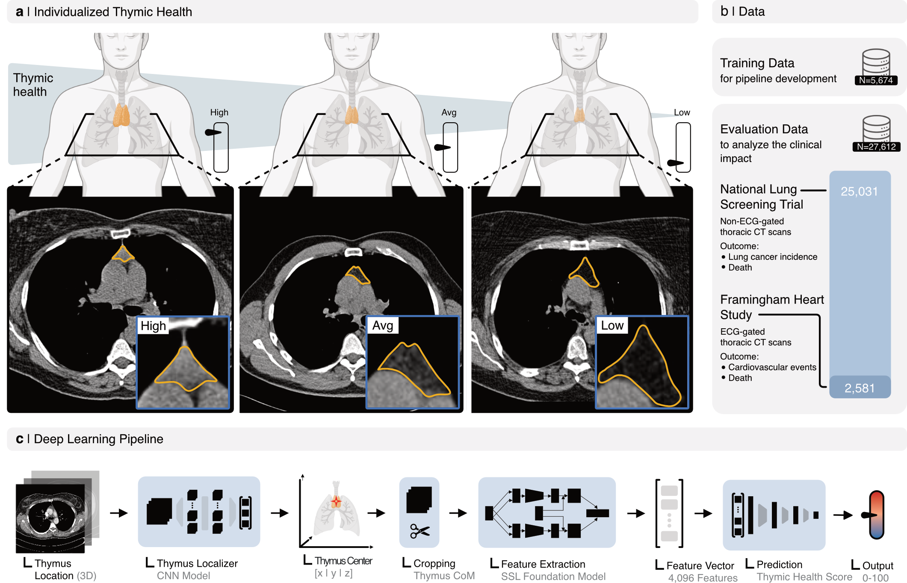

# Thymus Health Deep Learning System

This repository contains the source code accompanying two _Nature_ publications:

1. [Thymic health consequences in adults](https://www.nature.com/articles/s41586-026-10242-y.pdf)
2. [Thymic health and immunotherapy outcomes in patients with cancer](https://www.nature.com/articles/s41586-026-10243-x.pdf)

The codebase is organized into modules for segmentation and self-supervised learning pipelines used in the studies.

## Repository Structure

- `open_thymus_segmentator/`: Source code related to thymus segmentation workflows.
- `ssl_thymus_quantification/`: Source code related to self-supervised thymus quantification.

## Citation

If you use this repository in your research, please cite the resources listed below.

| Resource Description | Citation | Downloadable Citaiton |
| --- | --- | --- |
| Paper 1: Thymic health consequences in adults | Bernatz, S., Prudente, V., Pai, S. et al. Thymic health consequences in adults. Nature (2026). https://doi.org/10.1038/s41586-026-10242-y | [Paper 1 RIS](docs/assets/Misc/Paper1_10.1038_s41586-026-10242-y-citation.ris) |
| Paper 2: Thymic health and immunotherapy outcomes in patients with cancer | Bernatz, S., Prudente, V., Pai, S. et al. Thymic health and immunotherapy outcomes in patients with cancer. Nature (2026). https://doi.org/10.1038/s41586-026-10243-x | [Paper 2 RIS](docs/assets/Misc/Paper2_10.1038_s41586-026-10243-x-citation.ris) |
| Zenodo repository for paper 1's data | Prudente, V. C. G. et al. Resources “Thymic health consequences in adults”. Zenodo https://doi.org/10.5281/zenodo.18306999 (2026). | [Paper 1 Zenodo RIS](docs/assets/Misc/P1_Zenodo_18306999.ris) |
| Zenodo repository for paper 2's data | Prudente, V. C. G., Kjær, A., Bernatz, S., Pai, S., Swanton, C., Jamal-Hanjani, M., Birkbak, N., & Aerts, H. (2026). Resources "Thymic Health and immunotherapy outcomes in patients with cancer". Zenodo. https://doi.org/10.5281/zenodo.18330021 | [Paper 2 Zenodo RIS](docs/assets/Misc/P2_Zenodo_18330021.ris) |
| This GitHub Repository | Prudente, V. C. G., & Pai, S. (2025). GitHub ‘thymus_health_deeplearning_system’. Retrieved from https://github.com/AIM-Harvard/thymus_health_deeplearning_system.git | [GitHub RIS](docs/assets/Misc/GH_Repo_thymus_health_deeplearning_system.ris) |
| MHub.ai Thymus Segmentator | Coming soon | [MHub RIS](docs/assets/Misc) |
